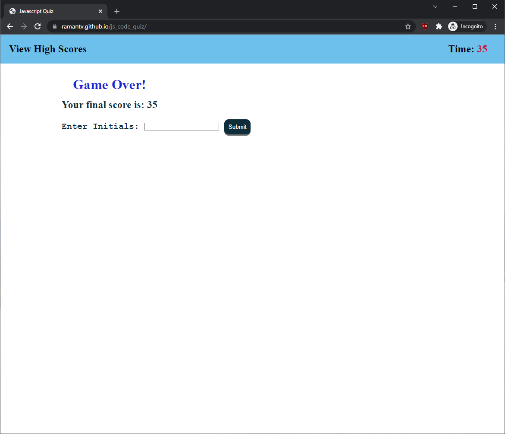

# Javascript Quiz Game

## Table of contents
* [General info](#general-info)
* [Code](#Code)
* [Website](#webpage-URL)
* [Repository](#repo)
* [Screenshots](#screenshots)
 

## General info
This program provides a timed multiple-choice quiz on JavaScript fundamentals that stores high scores. The quiz requires the user to answer 10 Javascript related questions within 120 seconds. Each incorrect answer will reduce 10 seconds the time left. The final score is the time left after all questions are answered.
 

## Code 
* HTML
* CSS
* JavaScript
 

## Website
[JavaScript Quiz Game](https://ramantv.github.io/js_code_quiz/)
 

## Repository
[Github Repository](https://github.com/ramantv/js_code_quiz)
 

## Screenshots

  

  

  

  
